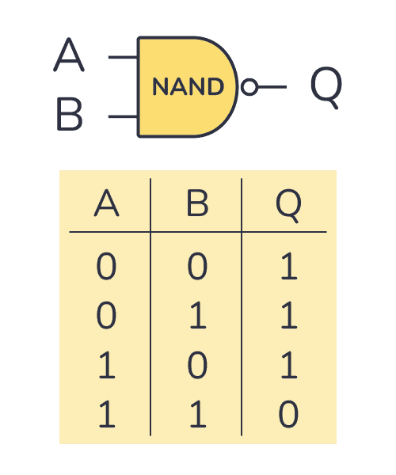

# Solution 
____________________________________________________________________________________________________________
For players who have no clue about integrated circuits and hardware , a simple Google search for the task name will show you a full list for the circuits used in our main circuit. 
As the description mentions , players need to explore every circuit and know its functions to understand the main function of the full circuit and how to reverse the output.

Looking at the circuit for the first time might be overwhelming , in real life circuits are more complicated.

Let's explore it in details : 
* First we have the input ( 4 bits ). Each bit is passed as an input for the 7432 circuit, which is an ORGATE circuit with the power (1). So all we have here is 1111 in the output because 1 OR X = 1.
* This output is passed to the 7408 circuit, which is an ANDGATE circuit , with the power (1). So all we have here also is 1111 because  1 AND 1 = 1.
* Now this output is passed to 2 circuits with the bits of the initial input.
* The circuit 7432 which is an ORGATE having the output of the previous circuit (7408) which is 1111 with the initial input , we will have 1111 as an output also because ( 1 OR X = 1).
* The circuit 7400 which is the most important as it represents a NANDGATE for the 1111 output with the intial input ( each bit of the input passes through a NAND gate with 1 )

 

Each 1 of the input will be converted to 0 in the output and each 0 will be converted to 1 . (equivalent to xor with 1 )

* The last circuit is 7408, an AND circuit with 1111 ( each bit will be passed by an ANDGATE with 1 ) which changes nothing , because 1 AND  X = X
Finally each bit of the 4 bits in the input is passed by a NAND with 1 . To solve the task there are different ways , here is a python solver in my own way. Each 8 bits represents the ascii caracater to retreive the flag !

The task was solved by 8 teams out of 119 teams registered in this online CTF.

````
out = ""
binary = ""
with open("74xx_out.txt", "r") as file:
    for line in file:
        line = line.replace(" ", "")
        for i in line:
            if i == '0':
                out += '1'
            elif i == '1':
                out += '0'
        binary += out
        out = ""  
print("Binary: ", binary)
flag=""
for i in range(0, len(binary), 8):
    byte = binary[i:i+8]
    flag += chr(int(byte, 2))

print("Flag : ", flag)
````
     Binary:  01001000001101000111001001000100011101110110000101010010001100110101111100110001011100110101111101001000001101000111001001100100010111110100001001110101010101000101111101010110001100110101001001111001010111110011001101100001010100110101100101011001010110010010000100100001
     Flag :  H4rDwaR3_1s_H4rd_BuT_V3Ry_3aSYYY!!
     Flag to submit : ghctf{H4rDwaR3_1s_H4rd_BuT_V3Ry_3aSYYY!!}


